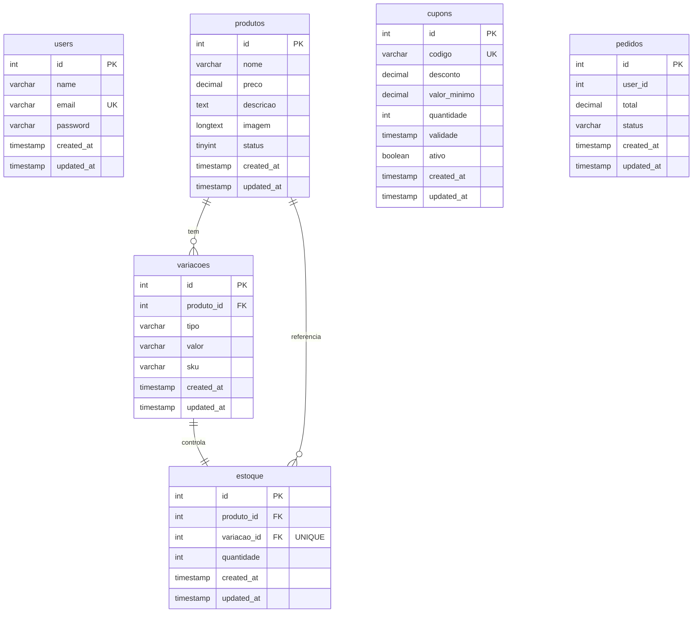
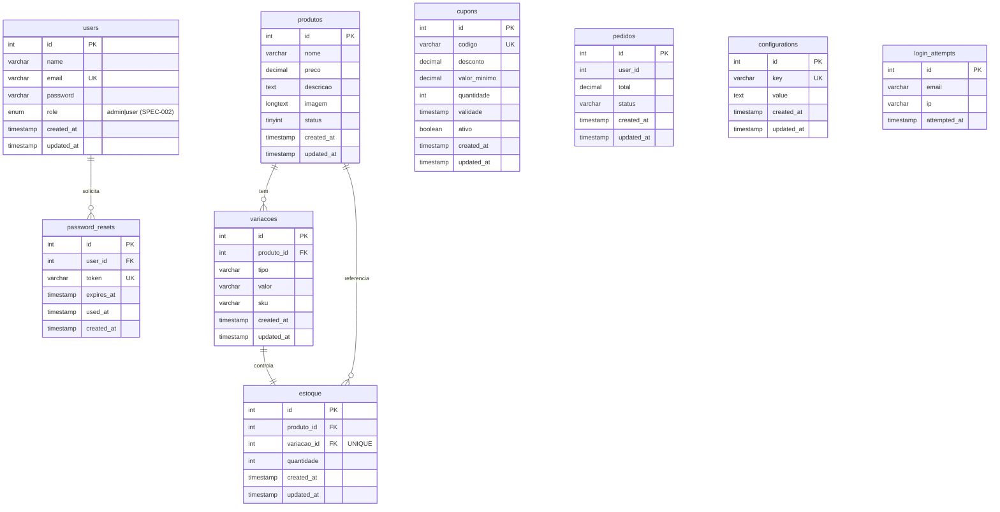

# Diagrama Entidade-Relacionamento

Diagrama ER do banco de dados em formato Mermaid. Inclui tabelas atuais e pendentes (marcadas).

> Renderizável no GitHub, VSCode (extensão Mermaid) e em `https://mermaid.live`.

---

## Diagrama Atual

---

## Diagrama com Tabelas Pendentes

Inclui tabelas que serão criadas pelas specs em andamento.

---

## Legenda

| Símbolo | Significado |
|---------|------------|
| `PK` | Primary Key |
| `FK` | Foreign Key |
| `UK` | Unique Key |
| `||--o{` | Um para muitos |
| `||--||` | Um para um |

---

## Notas

- A tabela `pedidos.user_id` não possui FK formal no schema atual (usuários eram gerados via `random_int`). Será formalizada após SPEC-002.
- Tabelas marcadas como _(SPEC-001)_ e _(SPEC-002)_ serão criadas via migrations quando as specs forem implementadas.
